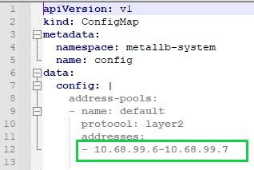
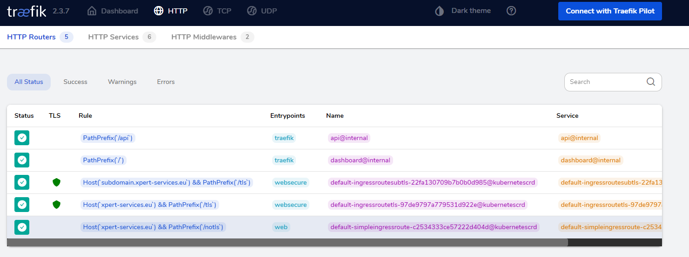

# Traefik TLS Implementation Using Let's Encrypt

  - [Requirements](#requirements)
  - [Implementation](#implementation)
    - [Install and configure MetalLB](#install-and-configure-metallb)
    - [Traefik deployment](#traefik-deployment)

## GETTING STARTED  

This guide detail the implementation of Traefik using an ACME compatible provider which in our case is Let's Encrypt.

The objective of this implementation is to be able to create a verified TLS certificate for the domain **xpert-services.eu** and all of it's sub-domains, those domains will be hosting various services used by the consultant to demonstrate external traffic routing using public DNS and Traefik Ingress controller.

ACME stand for Automatic Certificate Management Environment, which is a protocol to automate the process of verification and certificate issuance, Let's Encrypt and Traefik can use this protocol to automate certificates management process for different services hosted on Karbon and routed through Traefik.

The domain name **xpert-services.eu** is hosted on Digital Ocean, in this guide, you will be using Digital Ocean as a DNS provider to request and validate certificates issuance from Let's Encrypt.  

## Requirements

1. MetalLB

   MetalLB provides a network load-balancer implementation and will be responsible for providing Traefik instance with an ip address

2. DigitalOcean API token

    This token is used to generate the TXT record that will be used for validating the DNS challenge

3. Traefik YAML configuration files (see Appendix)

    The following 5 files will be used to install and configure Traefik and a test application to verify if the TLS certificate was generated correctly

     - **metallb-configmap.yaml**: MetalLB configuration file used for addresses allocation
     - **traefik-crd.yaml** : custom ressources definition and cluster role required for Traefik
     - **traefik-deployment.yaml**: Traefik and a test application deployment file
     - **traefik-service.yaml**: exposing Traefik service through a LoadBlancer and the test      application (whoami)
     - **traefik-ingressroutes.yaml**: this file describe the routing from the domain name into      the internal services hosted on Kubernetes/Karbon  

## Implementation  

### Install and configure MetalLB

    kubectl apply -f https://raw.githubusercontent.com/metallb/metallb/v0.9.6/manifests/namespace.yaml
    kubectl apply -f https://raw.githubusercontent.com/metallb/metallb/v0.9.6/manifests/metallb-configmap.yaml
    # On first install only
    kubectl create secret generic -n metallb-system memberlist --from-literal=secretkey="$(openssl rand -base64 128)"

The above commands will install MetalLB, but before you can use it, you have to update the **metallb-configmap.yaml** configuration file to include a range of available ip address, those addresses will be distributed to services of type **LoadBalancer** like Traefik.

### Traefik deployment  

Before deploying Traefik take a look at the following files:

- **traefik-deployment.yaml**: 

certificatesresolvers.myresolver.acme.caserver: This value specify Let's Encrypt server to use for requesting certificates, refer to the comment inside the file to see how to change it to Let's Encrypt production server.  

- **traefik-ingressroutes.yaml**:

This file include three ingress routes, first one is for non TLS path , second is for TLS path and the third is for a subdomain with a TLS path, with this you will be able to test Let's Encrypt certificates with their staging server before using the production server.

#### **Step 1:**

Create a secret that will include your Digital Ocean API token  

    kubectl create secret generic do-auth-token --from-literal=DO_AUTH_TOKEN=XXXXXXXXXXXXXXXXXXXXXXXXXXXXXXXXXXXXXXXXXXXXXXXXXXXXXXXX

#### **Step 2:**

Apply the configuration files  

    kubectl apply -f traefik-crd.yaml
    kubectl apply -f traefik-deployment.yaml
    kubectl apply -f traefik-service.yaml
    kubectl apply -f traefik-ingressroutes.yaml
     
     
#### **Step 3**:

As you are using MetalLB to get an ip address for Traefik service, you have to get that ip to access Traefik management console.  

    kubectl get svc traefik -o json | jq '.status.loadBalancer.ingress[0].ip'
    "10.68.99.6"

Now that everything is in place you can proceed to test the configuration.

First update you hosts file to include the domain name **xpert-services.eu** with Traefik public ip address.

**Windows:** C:\Windows\System32\drivers\etc\hosts

**Linux:** /etc/hosts

    10.68.99.6      xpert-services.eu
    10.68.99.6      subdomain.xpert-services.eu

Using curl or you browser navigate to http://xpert-services.eu/notls to test the HTTP configuration

    $ curl http://xpert-services.eu/notls
    Hostname: whoami-7848c44b66-hfh7m
    IP: 127.0.0.1
    IP: 172.20.108.137
    RemoteAddr: 172.20.238.17:49898
    GET /notls HTTP/1.1
    Host: xpert-services.eu
    User-Agent: curl/7.75.0
    Accept: */*
    Accept-Encoding: gzip
    X-Forwarded-For: 10.68.99.106
    X-Forwarded-Host: xpert-services.eu
    X-Forwarded-Port: 8000
    X-Forwarded-Proto: http
    X-Forwarded-Server: traefik-55d486c998-jb5ps
    X-Real-Ip: 10.68.99.106

To test the HTTPS sub-domain configuration https://subdomain.xpert-services.eu/tls

    $ curl https://subdomain.xpert-services.eu/tls
    Hostname: whoami-7848c44b66-hfh7m
    IP: 127.0.0.1
    IP: 172.20.108.137
    RemoteAddr: 172.20.238.17:50544
    GET /tls HTTP/1.1
    Host: subdomain.xpert-services.eu
    User-Agent: curl/7.75.0
    Accept: */*
    Accept-Encoding: gzip
    X-Forwarded-For: 10.68.99.106
    X-Forwarded-Host: subdomain.xpert-services.eu
    X-Forwarded-Port: 4443
    X-Forwarded-Proto: https
    X-Forwarded-Server: traefik-55d486c998-jb5ps
    X-Real-Ip: 10.68.99.106

To test the HTTPS configuration at the root domain https://xpert-services.eu/tls

    $ curl https://xpert-services.eu/tls
    Hostname: whoami-7848c44b66-hfh7m
    IP: 127.0.0.1
    IP: 172.20.108.137
    RemoteAddr: 172.20.238.17:54412
    GET /tls HTTP/1.1
    Host: xpert-services.eu
    User-Agent: curl/7.75.0
    Accept: */*
    Accept-Encoding: gzip
    X-Forwarded-For: 10.68.99.106
    X-Forwarded-Host: xpert-services.eu
    X-Forwarded-Port: 4443
    X-Forwarded-Proto: https
    X-Forwarded-Server: traefik-55d486c998-jb5ps
    X-Real-Ip: 10.68.99.106

Traefik configuration should look like this from the GUI http://<TRAEFIK_PUBLIC_IP>:8080/dashboard/:​​​​​​​  

